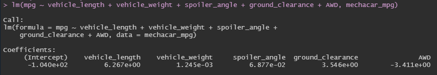
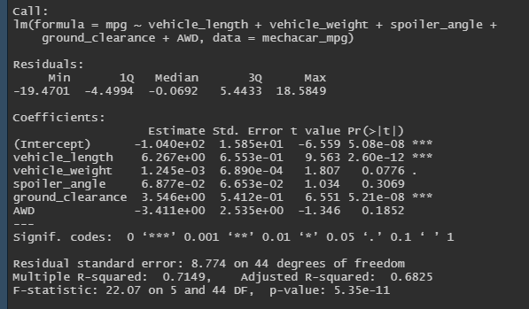
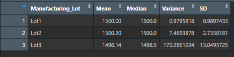
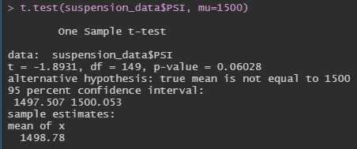
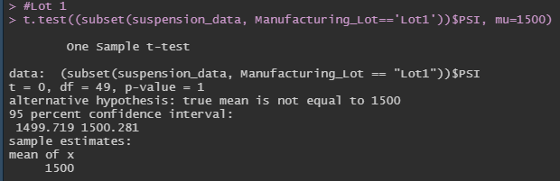
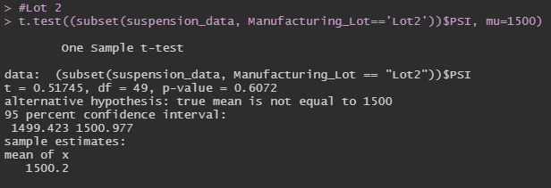
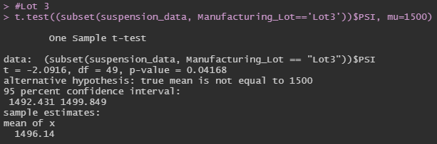

# MechaCar_Statistical_Analysis
AutosRUs’ newest prototype, the MechaCar, is suffering from production troubles that are blocking the manufacturing team’s progress. AutosRUs’ upper management has called us to review the production data for insights that may help the manufacturing team.

## Overview of Project:
1. ***Deliverable 1***: Linear Regression to Predict MPG
2. ***Deliverable 2***: Summary Statistics on Suspension Coils
3. ***Deliverable 3***: T-Test on Suspension Coils
4. ***Deliverable 4***: Design a Study Comparing the MechaCar to the Competition

## Resources and Data:
* Data Source: `MechaCar_mpg.csv` and `Suspension_Coil.csv`
* Software: RStudio 2022.02.3
***

## Deliverable 1: Linear Regression to Predict MPG
In this section, we conducted a multiple linear regression analysis to determine which variables predict the mpg of MechaCar prototypes. See results and summary below:

Result of linear regression analysis:

Summary of analysis:

- **Which variables/coefficients provided a non-random amount of variance to the mpg values in the dataset?**
In the summary output, each Pr(>|t|) value represents the probability that each coefficient contributes a random amount of variance to the linear model. The most significant variables in our dataset which show a non-random effect on the MPG of the MechaCar are the Vehicle Length and the Ground Clearance. A linear regression analysis on these variables against figures for MPG, resulted in p-values of 2.6x10-12 and 5.21x10-8, respectively

- **Is the slope of the linear model considered to be zero? Why or why not?**
The slope of the linear model is not considered to be zero. This is because the p-value of the linear model was much smaller than the significance level, providing sufficient statistical evidence that the null hypothesis is not true.

- **Does this linear model predict mpg of MechaCar prototypes effectively? Why or why not?**
From the linear regression summary, the r-squared value is 0.7149, which means 71.49% of the variability of the dependent variable mpg is explained by the linear regression model. This number tells us that the linear model does predict mpg of MechaCar protypes effectively.
***

## Deliverable 2: Summary Statistics on Suspension Coils
In this section, we summarized the statistics of the PSI of the supension coils as a whole and per manufacturing lots. 
Summary of the entire manufacturing site:

Summary for each lot:

- **The design specifications for the MechaCar suspension coils dictate that the variance of the suspension coils must not exceed 100 pounds per square inch. Does the current manufacturing data meet this design specification for all manufacturing lots in total and each lot individually? Why or why not?**

The variance of the suspension coils for all three lots was 62.29. This is within MechaCar design specifications.

When examining the PSI of suspension coils in Lots 1, 2, and 3 individually, analysis indicated that the variance in Lots 1 and 2 are within the design specification. However, the variance for Lot3 is at 170.2861224, which is 70.2861224 PSI over the design specification. 
***

## Deliverable 3: T-Test on Suspension Coils
For this section, three t-tests were conducted to determine if the manufacturing lots are statistically different from the presumed mean population.

For all t-tests conducted, the significance level was 0.05 percent. The t-test compared the means of the Suspension Coil dataset, which was 1498.78, against a mean of 1500. All t-tests conducted resulted in the means being statistically similar.

A t-test across all suspension coil manufacturing lots gave a p-value of 0.06 Since this is above the significance level, the two means are statistically similar.

A t-test for Lot 1 gave a p-value of 1, which is above the significance level. The two means are statistically similar.

The p-value for the Lot 2 t-test was 0.6072. This is above the significance level of 0.05 results in the two means being statistically similar.

The calculated p-value from the Lot 3 t-test was 0.4168. This is above the 0.05 significance level and results in the means being statistically similar.

## Deliverable 4: Design a Study Comparing the MechaCar to the Competition
The cost of owning and maintaining a vehicle can be expensive, so AutosRUs wants to make sure their customers are getting the best value over their competitors and would like to measure the rate of depreciation for MechaCars against other manufacturers.

- **What metric or metrics are you going to test?**
* Rate of depreciation (value of vehicle over time) vs other manufcaturers

- **What is the null hypothesis or alternative hypothesis?**
* Null hypothesis: Rate of depreciation for MechaCars is equal to their competitors

* Alternative hypothesis: Rate of depreciation for MechaCars is not equal to their competitors

- **What statistical test would you use to test the hypothesis? And why?**
* Data analysts will use multiple linear regression to predict MechaCar's rate of depreciation

- **What data is needed to run the statistical test?**
* In order to perform multiple linear regression to predict rate of depreciation, analysts will need vehicle values, age, and mileage
